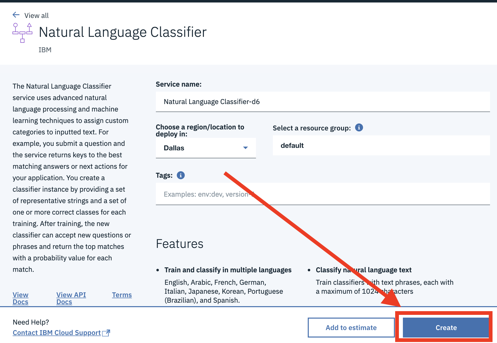

# Watson Natural Language Classifier 101 Lab - Build A Classifier In 15 Minutes

In this lab we will be using IBM Watson Natural Language Classifier (NLC) to train a classification model using a sample data sets. This example and data sets have been sourced from the [Support ticket classification](https://developer.ibm.com/patterns/watson-studio-nlc-technical-support-ticket-categorization/) code pattern, the [Detect email phising](https://developer.ibm.com/patterns/predict-phishing-attempts-in-email-with-nlc/) code pattern and a [great blog](https://medium.com/ibm-watson/get-started-with-ai-in-15-minutes-28039853e6f3) from Reid Francis. You will be able to build a classifier against one of the following labeled data sets:

* A [consumer complaint dataset](https://www.consumerfinance.gov/data-research/consumer-complaints/#download-the-data) (*Please note that this data is free to use for non-commercial use, and explicit permission must be obtained otherwise*). To create a classification model that will determine if a given piece of text is discussing a mortgage, banking, loans or credit card related product complaint. Although this is a single months filtered set of complaints with narratives, it takes longer to train than the other data sets.
* An [Airbnb review](http://insideairbnb.com/get-the-data.html) data set. To create a classification model that will determine if a review text is discussing issues related to Noise, Hospitality, Cleanliness, Environment, Location, Amenities, Communication or somthing else.
* A Weather data set.

When you have completed this lab you will have:

* Built a [Watson Natural Language Classifier](https://www.ibm.com/watson/services/natural-language-classifier/) model using just the REST APIs for the service.
* (Optionally) Run a sample Node js app that utilizes the custom NLC model to classify collection of consumer complaint support ticket text into various categories.

# Lab Flow

1. [Setup your environment](#environment-setup)
1. [Train your model](#train-the-nlc-model)
1. [Test your model](#test-the-nlc-model)
1. (Optional) [Run the sample application](#5-run-the-application)

## Environment Setup

1. Clone this `Think-NLC-101-Lab` locally. In a terminal, run:
   ```
   $ git clone https://github.com/jrtorres/Think-NLC-101-Lab.git
   ```

1. Go to the [IBM Cloud console]((https://cloud.ibm.com)) - (https://cloud.ibm.com) and log in.

1. Click on the **`Catalog`** link in the top banner of the IBM Cloud dashboard.  
   

1. Select the AI category on the left, under `All Categories`.  
   

1. Select the Natural Language Classifier service tile.  
   

1. Leave the default options and click the **`Create`** button.  
   

1. On the service page. Click on the **`Service Credentials`** link on the left side panel.
   

1. Click on the `View credentials` drop down to expose the service credentials. If you do not have credentials pre-populated, click on the `New credentials` button, leave all the defaults and click the `Add` button in the pop up window.  
   

1. These are the access credentials you will need to interact with your NLC service. Copy and Save the `apikey` and `url` values.


## Train the NLC model

1. We are now ready to use the training data set and create a classification model. The data is structured to be a set of text examples with their associated class label (or multiple class labels). These are the labels the model will predict in the future when given text. Feel free to open the training data for one of the data sets (in the `\data-sets\ folder) to see the structure of the data. The first column represents an example piece of text and the subsequent columns represent the label we assign to that text (i.e what we want the model to predict).

1. Open a terminal and navigate to the root directory of your local clone of this Github repository.

1. We can create an NLC model using the REST APIs. It will require the training data file as well as some metadata for the new model (i.e the language of the model and name of the model), which we have provided in the [metadata.json file](data-sets/metadata.json). Issue the following curl command to start the training. Be sure to supply **YOUR API KEY** that you copied in the prior section, also feel free to use a different data set by changing the file supplied in the training_data parameter.
   ```
   $ curl -u "apikey:YOUR_API_KEY_HERE" -F training_data=@data-sets/airbnb/airbnb_categories_smallsubset.csv -F training_metadata=@data-sets/metadata.json "https://gateway.watsonplatform.net/natural-language-classifier/api/v1/classifiers"
   ```

1. The command will start the training and return the classifier ID:
   

1. The model will take several minutes to train (or longer depending on the data set selected). You must wait for the model to become 'Available' before you can use it. To check the status of the model, and access it after it trains, use the following curl command to get the status of the classifier created above (remember to substitute **YOUR API KEY** and **YOUR CLASSIFIER ID** values in the command.).  
   ```
   $ curl -u "apikey:YOUR_API_KEY_HERE" "https://gateway.watsonplatform.net/natural-language-classifier/api/v1/classifiers/YOUR_CLASSIFIER_ID"
   ```

1. When the status changes to **`Available`**, the model will be ready to test.
   

## Test the NLC model

1. We can now test our classification model using a phrase relative to the data set you used to create the classifier. For the Airbnb dataset for example, you might try "This was a very clean and welcoming home.We were a group of 7 and had plenty of living space". For the consumer complaint data set, you might try "I send my credit card payment on time every month and they charge me fees in the form of interest, I have contacted them once before and they said it would not happen again, it has happened again and they charge finance charges".

1. Open a terminal and issue the following curl command to classify some text. Be sure to supply **YOUR API KEY** you copied in the prior section and the **YOUR CLASSIFIER ID**.
   ```
   $ curl -G -u "apikey:YOUR_API_KEY_HERE" "https://gateway.watsonplatform.net/natural-language-classifier/api/v1/classifiers/YOUR_CLASSIFIER_ID/classify" --data-urlencode "text=YOUR_TEXT_TO_CLASSIFY"
   ```

1. The model will respond with the labels it is predicting and their associated confidence.  
   

**You have now completed the lab to create an NLC model. Feel free to proceed to the next section to call the classifier model through a sample application**

## Run the Application

Follow the steps in the application README to configure and run the sample application.

**[Sample Application Readme](server/README.md)**

# Links and Resources

* [Watson Natural Language Classifier Documentation](https://console.bluemix.net/docs/services/natural-language-classifier/getting-started.html#natural-language-classifier)
* [Watson Natural Language Classifier Demo](https://github.com/watson-developer-cloud/natural-language-classifier-nodejs)
* [Watson Node.js SDK](https://github.com/watson-developer-cloud/node-sdk)
* [Classify Support Tickets Code Pattern](https://developer.ibm.com/patterns/watson-studio-nlc-technical-support-ticket-categorization/)
* [Email phising Classifier Code Pattern](https://developer.ibm.com/patterns/predict-phishing-attempts-in-email-with-nlc/)
* [AI Code Patterns](https://developer.ibm.com/technologies/artificial-intelligence/).