# Watson Natural Language Classifier 101 Lab - Build A Classifier In 15 Minutes

In this lab we will be using IBM Watson Natural Language Classifier (NLC) to train a classification model using a sample data sets. This example and data sets have been sourced from the [Support ticket classification](https://developer.ibm.com/patterns/watson-studio-nlc-technical-support-ticket-categorization/) code pattern, the [Detect email phising](https://developer.ibm.com/patterns/predict-phishing-attempts-in-email-with-nlc/) code pattern and a [great blog](https://medium.com/ibm-watson/get-started-with-ai-in-15-minutes-28039853e6f3) from Reid Francis. You will be able to build a classifier against one of the following labeled data sets:

* A [consumer complaint dataset](https://www.consumerfinance.gov/data-research/consumer-complaints/#download-the-data) (*Please note that this data is free to use for non-commercial use, and explicit permission must be obtained otherwise*). To create a classification model that will determine if a given piece of text represents a mortgage, banking, loans or credit card related support ticket.
* An [Airbnb review](http://insideairbnb.com/get-the-data.html) data set. To create a classification model that will determine if a review text is discussing issues related to Noise, Hospitality, Cleanliness, Environment, Location, Amenities, Communication or somthing else.

When you have completed this lab you will have:

* Built a [Watson Natural Language Classifier](https://www.ibm.com/watson/services/natural-language-classifier/) model using the [Watson Studio](https://www.ibm.com/cloud/watson-studio) tooling.
* (Optionally) Run a sample Node js app that utilizes the custom NLC model to classify collection of consumer complaint support ticket text into various categories.

# Lab Flow

1. [Setup your environment](#environment-setup)
1. [Train your model](#train-the-nlc-model)
1. [Test your model](#test-the-nlc-model)
1. (Optional) [Run the sample application](#5-run-the-application)

## Environment Setup

1. Clone this `REPO-NAME` locally. In a terminal, run:

```
$ git clone https://github.com/IBM/support-ticket-classification.git
```

1. Go to the [IBM Cloud console]((https://cloud.ibm.com)) - (https://cloud.ibm.com) and log in.

1. Click on the **`Catalog`** link in the top banner of the IBM Cloud dashboard.  
   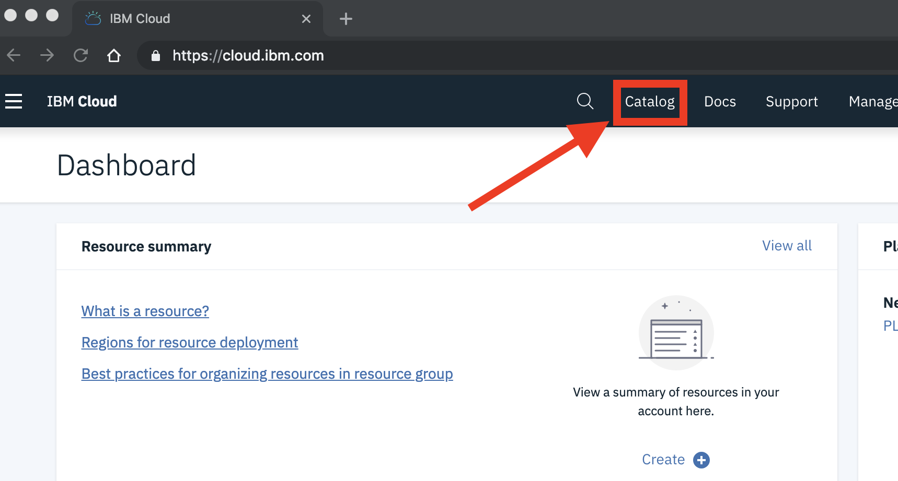

1. Select the AI category on the left, under `All Categories`.  
   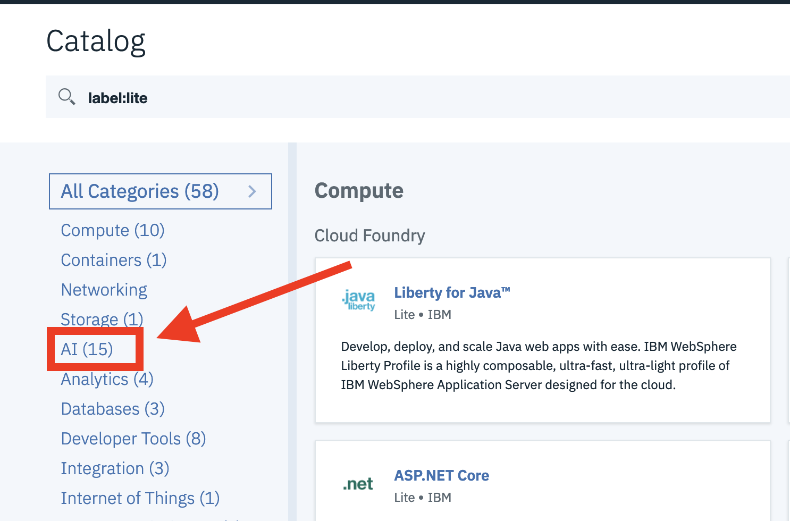

1. Select the Watson Studio service tile.  
   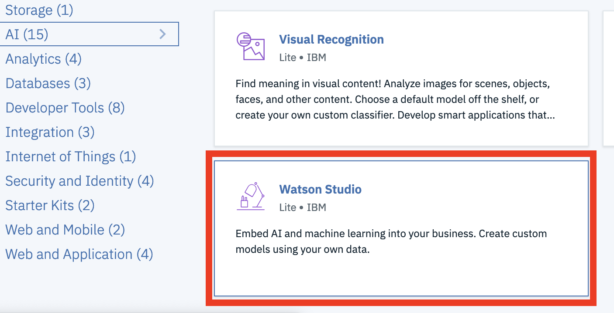

1. Leave the default options and click the **`Create`** button.  
   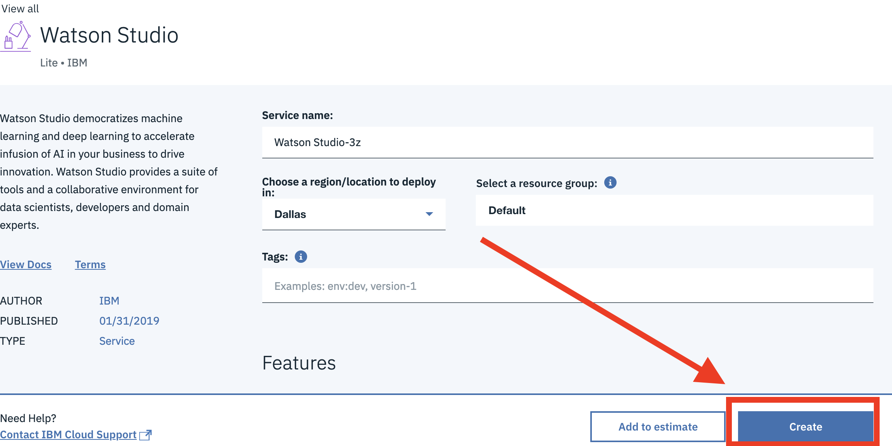

1. On the service page. Click on the **`Get Started`** button. A new page will open for the Watson Studio tooling.  
   

1. Inside of Watson Studio, you will now create a project to store the assets necessary to create the classifier. Click on the **`Create a project`** tile.  
   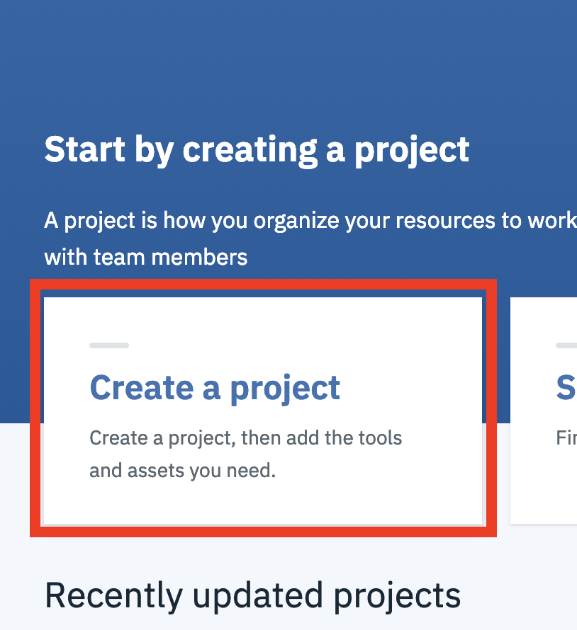

1. You have different options for the type of project, depending on what kind of work you will be doing in Watson Studio and what kind of services/features you will be using. Select the **`Standard`** option to create a project with all features.  
   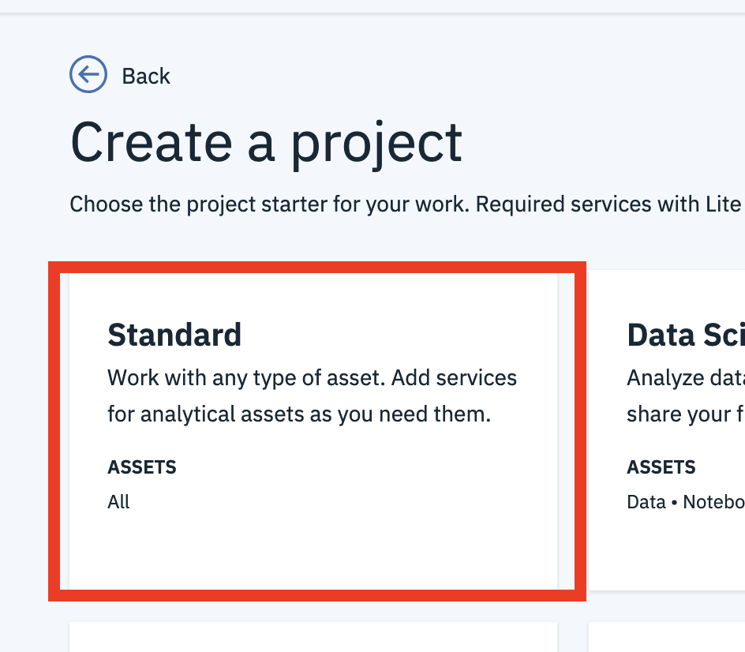

1. Before you can create the project. You will need to create an object storage where all the project assets will be stored. Under the `Define storage` section, click on the **`Add`** link to create a new instance of Cloud Object Storage.  
   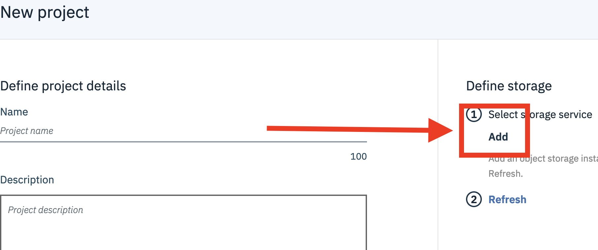

1. Leave the default options and click the **`Create`** button and then click the **`Confirm`** button in the subsequent window.  
   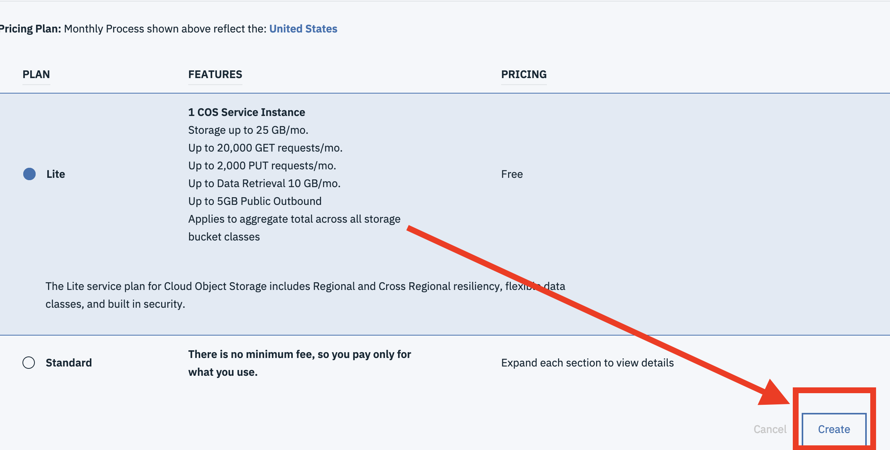

1. You will be taken back to the `New Project` page. Give your project a name ('NLCLab101') and click the `Create` button. (*Note: you may have to click the refresh option if the storage is not prefilled with the name of the cloud object storage instance you created in the prior step*).  
   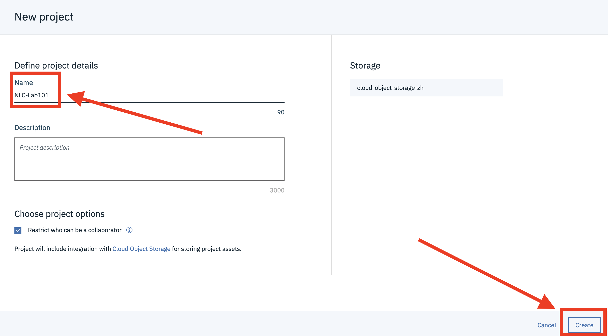

1. Now you will associate a Natural Language Classifier service to your project. Click on the **`Settings`** tab, scroll down to `Associated services` then click **`+ Add service`** drop down and select the **`Watson`** option:  
   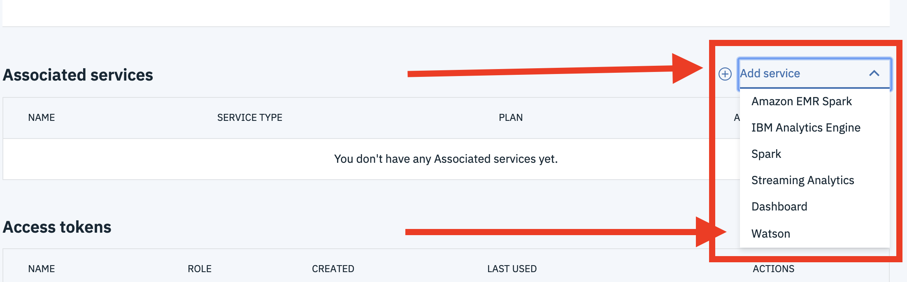

1. Scroll down to select the `Natural Language Classifier` tile and click the **`Create`** button. Note that you may have to select the service plan. The 'Standard' service plan allows for a single free model.  
   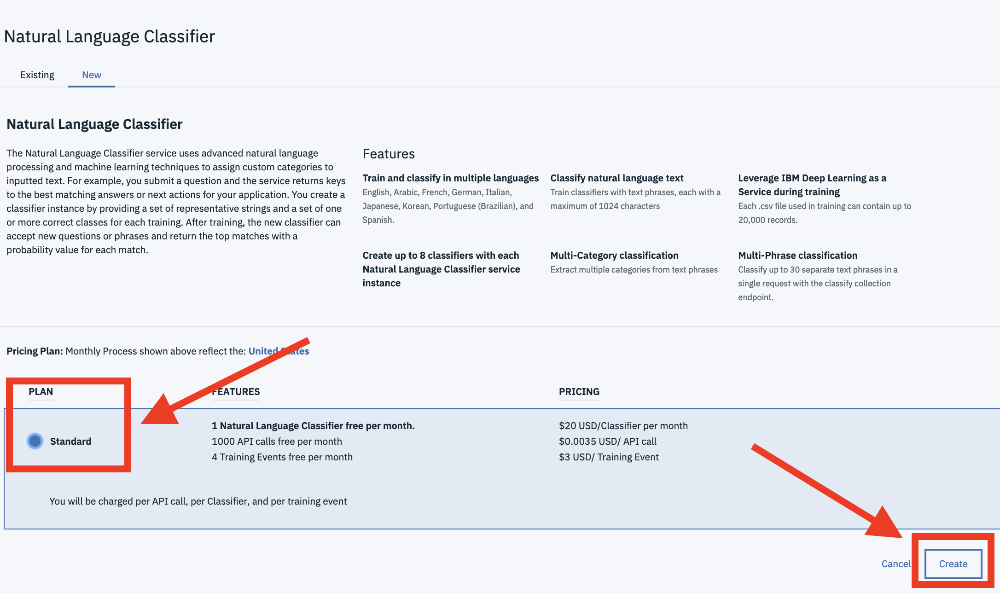

1. In the confirmation window, you can either leave all the defaults or change the name of the NLC service instance. Click the **`Confirm`** button.  
   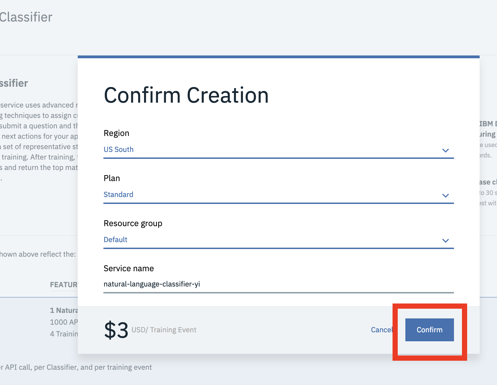

## Train the NLC model

1. We are now ready to use the training data set and create a classification model. In your project, click on the **`Assets`** tab and then click on the **`Add to project`** button on the top right.  
   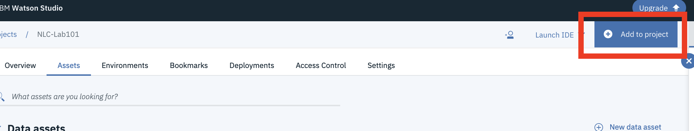

 1. Click `Natural Language Classifier model` type to bring up the `New Classifier` tooling page where you will be able to create and train a model.  
   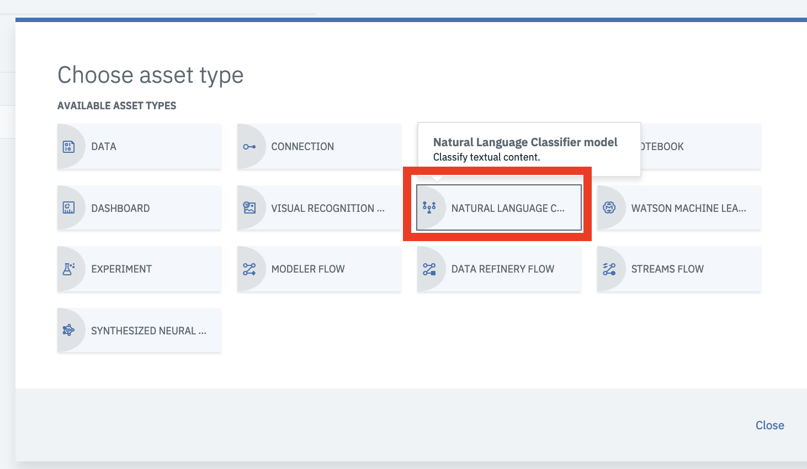

1. We now need to add the training data. The data is structured to be a set of text examples with their associated class label (or multiple class labels). These are the labels the model will predict in the future when given text. Feel free to open the training data (in the `\data-sets\ folder) to see the structure of the data. The first column represents an example piece of text and the subsequent columns represent the label we assign to that text (i.e what we want the model to predict).

1. On the right hand panel. Add the data set to your project by clicking the `Browse` button, browse to where you cloned this repo and select the csv files for the data-set you want to use. *Note: For the purposes of this lab, within the data set you want to use find the files with a `_smallsubset.csv` postfix. These are smaller data sets so that the model will train faster.*  
   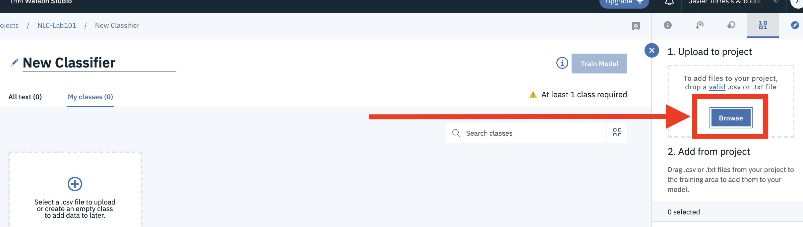

1. Once the CSV file is uploaded. Click on the three button menu and click on **`Add to model`** option.  
   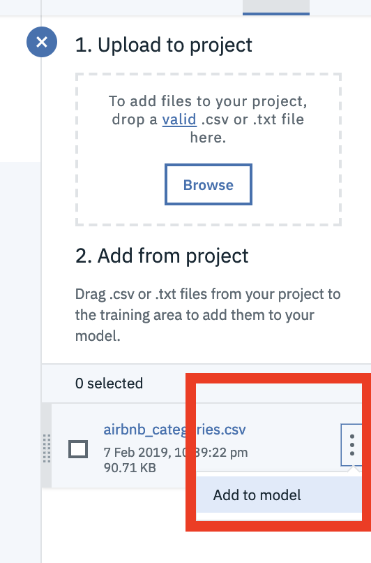

1. You can now give your model a name (i.e 'AirbnbReviewModel') in the top right and then Click on the `Train model` button. You will be presented with a dialog to specify the language of the model. Select `English` and click the **`Train`**button to begin training. The model will take several minutes to train (or longer depending on the data set selected).  
   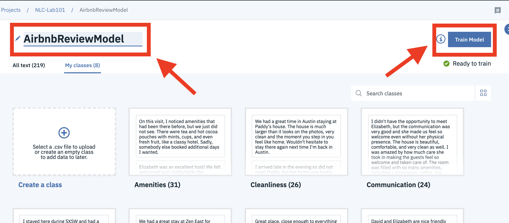

1. You must wait for the model to become 'Available' before you can use it. To check the status of the model, and access it after it trains, go to the `Assets` tab of your project. Under the `Models` section, you should see the model name you provided when you kicked off the training. Click the model name to see the `Overview` tab with metadata about your model.  
   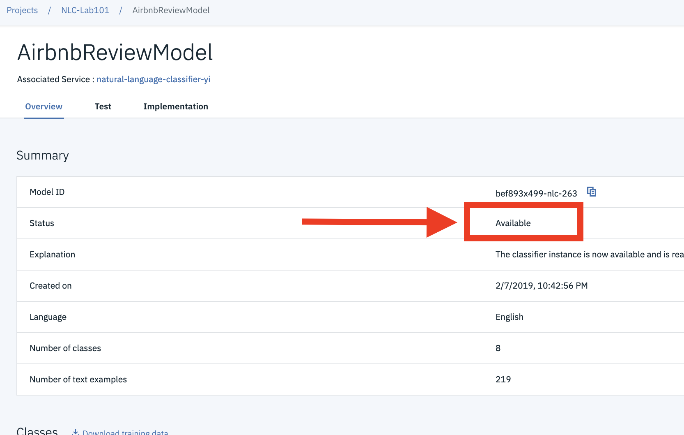

1. When the status changes to **`Available`**, the model will be ready to test.

## Test the NLC model

1. We can now test our classification model. In your project, click on the **`Assets`** tab. Under the `Models` section, Click the model name to see the `Overview` tab.

1. Now Click on the `Test` tab.  
   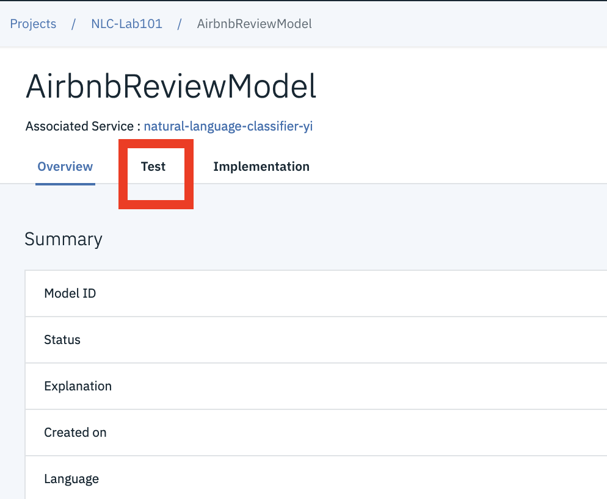

1. Enter a phrase relative to the data set you used to create the classifier. For the Airbnb dataset for example, you might try "This was a very clean and welcoming home.We were a group of 7 and had plenty of living space". For the consumer complaint data set, you might try "I send my credit card payment on time every month and they charge me fees in the form of interest, I have contacted them once before and they said it would not happen again, it has happened again and they charge finance charges". Then click the **`Classify`** button.  
   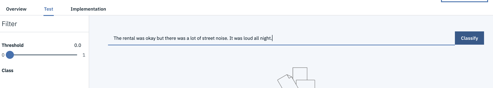

1. The model will respond with the labels it is predicting and their associated confidence. A couple of things to notice are that the UI will highlight the class label with the largest confidence and the model provides an absolute confidence score for each class. Also notice that you set a threshold in the UI to filter what gets returned.  
   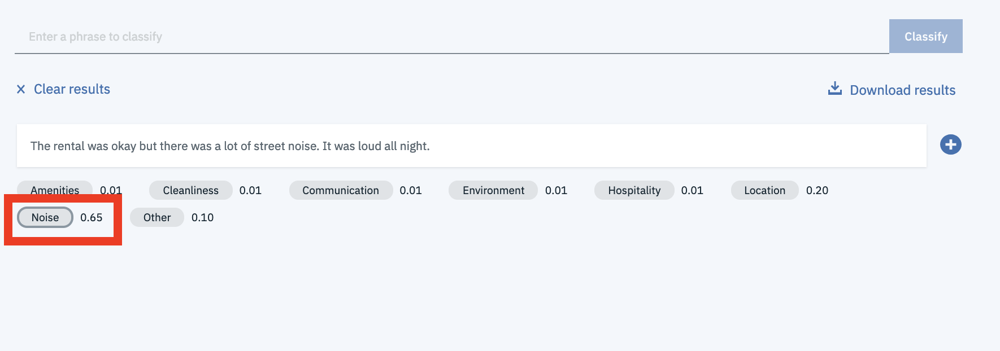

1. Also note that you can click on the `Implementation` tab to see how to use the classifier with Curl, Java, Node, or Python.

**You have now completed the lab to create an NLC model. Feel free to proceed to the next section to call the classifier model throug a sample application**

## Run the Application

Follow the steps in the application README to configure and start the sample application.

# Links and Resources

* [Watson Natural Language Classifier Documentation](https://console.bluemix.net/docs/services/natural-language-classifier/getting-started.html#natural-language-classifier)
* [Watson Natural Language Classifier Demo](https://github.com/watson-developer-cloud/natural-language-classifier-nodejs)
* [Watson Node.js SDK](https://github.com/watson-developer-cloud/node-sdk)
* [Classify Support Tickets Code Pattern](https://developer.ibm.com/patterns/watson-studio-nlc-technical-support-ticket-categorization/)
* [Email phising Classifier Code Pattern](https://developer.ibm.com/patterns/predict-phishing-attempts-in-email-with-nlc/)
* [AI Code Patterns](https://developer.ibm.com/technologies/artificial-intelligence/).