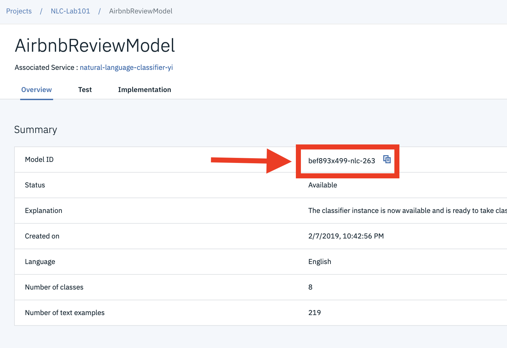
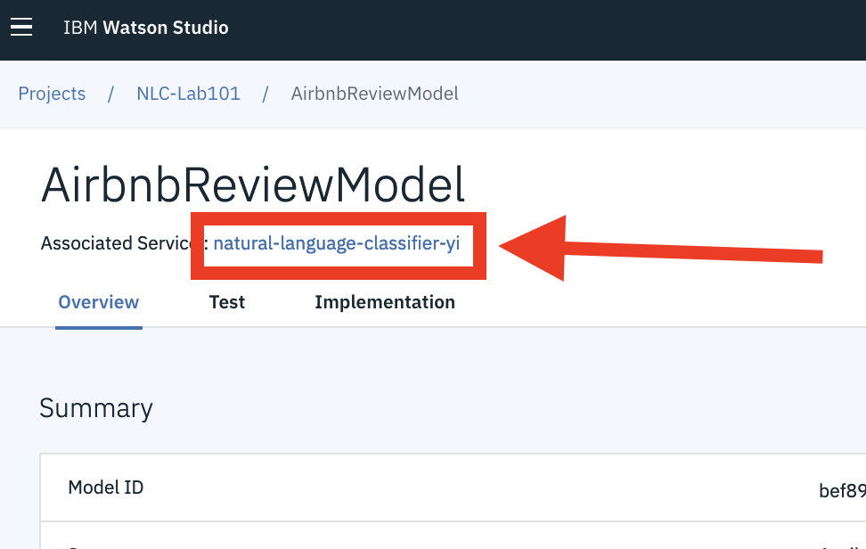
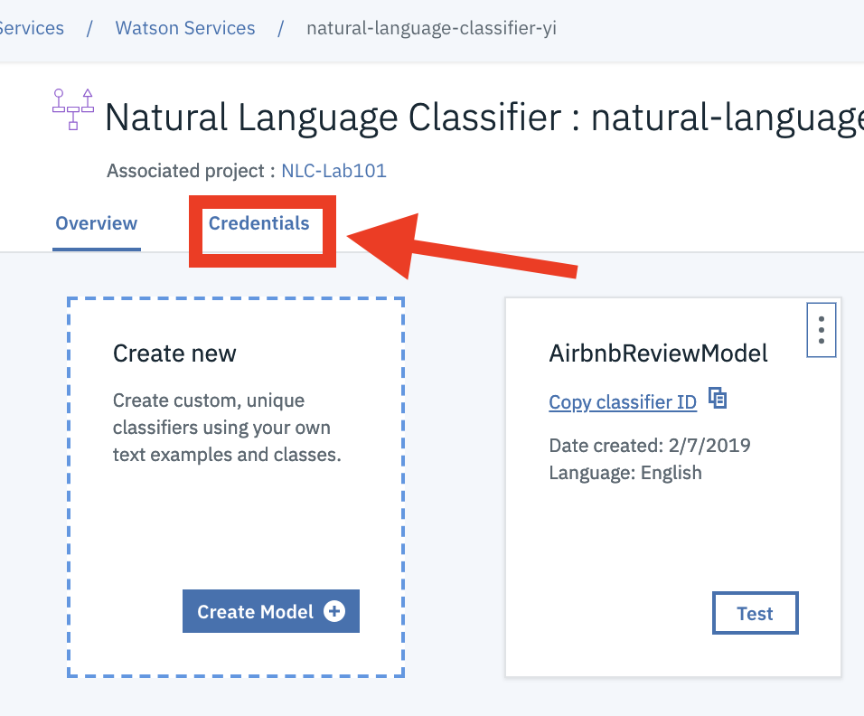
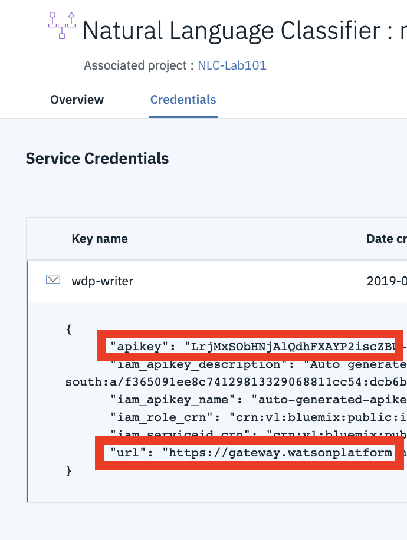

# Natural Language Classifier Demo Application

## This is based on the sample application provided in the Watson Developer Cloud Github repository - https://github.com/watson-developer-cloud/natural-language-classifier-nodejs

## Configuring the application

1. The Natural Language Classifier (NLC) model must be trained and in an `Available` state before running the application.

1. From the Watson Studio tooling, we will need to gather access details for our NLC service instance and the ID for the model we will be calling.

1. Open Watson Studio and find the project where you created the NLC model. Click on the project name and then click on the **`Assets`** tab. Under the `Models` section, Click the NLC model name to see the `Overview` tab. Copy the **Model ID** from this page and save it for later.
   

1. Now click on the NLC service instance name near the top of the page (i.e under the model name)
   

1. Click on the **`Credentials`** tab.
   

1. In the `Service Credentails` panel, expand the credential name and copy the value associated to **`apikey`** and the value associated to **`url`**. Save these for the later.
   

1. Open a terminal window and navigate to the application folder (where you have this Github Repo cloned), change to the `/server` directory.

1. Copy the *.env.example* file and create a file called *.env* where you will place the values you copied above.

    ```
    cp .env.example .env
    ```

1. Open the *.env* file and add the service credentials and model ID that you obtained in the previous step.

    Example *.env* file that configures the `apikey` and `url` for a Natural Language Classifier service instance hosted in the US East region:

    ```
    CLASSIFIER_ID=522be-7b41-ab44-dec3-g1eab2ha73c6
    NATURAL_LANGUAGE_CLASSIFIER_IAM_APIKEY=X4rbi8vwZmKpXfowaS3GAsA7vdy17Qh7km5D6EzKLHL2
    NATURAL_LANGUAGE_CLASSIFIER_URL=https://gateway.watsonplatform.net/natural-language-classifier/api
    ```

1. Save the file.

## Running locally

1. Install the dependencies. From the terminal window, run the following command:

    ```
    npm install
    ```

1. Run the application. From the terminal window, run the following command:

    ```
    npm start
    ```

1. View the application in a browser at `localhost:3000`. Enter some text in the input box and click the **`Ask`** button.

## License

This sample code is licensed under Apache 2.0.  
Full license text is available in [LICENSE](LICENSE).

## Contributing

See [CONTRIBUTING](CONTRIBUTING.md).

## Open Source @ IBM

Find more open source projects on the
[IBM Github Page](http://ibm.github.io/).
